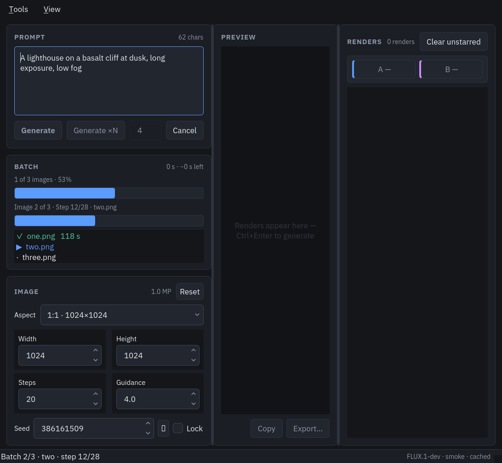

# FLUX Gen Studio

A small desktop studio for generating images with
[FLUX.1-dev](https://huggingface.co/black-forest-labs/FLUX.1-dev) or
[FLUX.2-dev](https://huggingface.co/black-forest-labs/FLUX.2-dev),
built with PyQt5 and Hugging Face `diffusers`. Sister project to
**Voice Design Studio** — same dark studio theme, same three-pane layout,
same keep/compare workflow, but for images instead of voices.



## Running

```bash
python3 -m venv --system-site-packages .venv   # reuses system torch/PyQt5
.venv/bin/pip install -r requirements.txt
./run.sh
```

First launch loads FLUX.1-dev from the local Hugging Face cache (no network
needed if it's already there — the status bar says which). **Tools ▸ Model**
switches to FLUX.2-dev (also `--model flux2`); see [Models](#models) below
for what each needs. Placement adapts to the VRAM actually free at launch:
full GPU (40 GB+), per-component CPU offload (24 GB cards), or
layer-streaming sequential offload when another app — for example Voice
Design Studio — already holds part of the card. Measured on the RTX 3090
with the voice studio running: ~4.2 s/step for FLUX.1-dev, so a 28-step
1024×1024 render takes about two minutes; with the card free, CPU offload is
roughly twice as fast. The status bar shows the model, the active mode and
s/step.

## Workflow

- **Prompt** (left): describe the image; FLUX has no negative prompt — say
  what you want. `Ctrl+Enter` renders one image; **Generate ×N** explores N
  random seeds; **Batch…** (`Ctrl+B`) renders every prompt in a JSON file.
- **Image** (left, below): aspect presets around the model's ~1 MP sweet
  spot, steps, guidance, and the seed row — 🎲 rolls a new seed, **Lock**
  reuses it so a prompt edit is the only variable.
- **Preview** (center): the selected render, scaled to fit, never upscaled.
  **Copy** puts it on the clipboard, **Export…** (`Ctrl+S`) saves a PNG.
- **Renders** (right): every generation as a card — click to preview, ★ to
  keep, ⟳ re-roll, ↩ restore the exact recipe into the editor, pin any two
  as **A**/**B** (`Ctrl+1`/`Ctrl+2`) to flip between them in the preview.
  **Clear unstarred** deletes everything you didn't star.
- `Esc` cancels a running job after the current step.

On a HiDPI screen the app picks a sensible text size by itself when the
desktop hasn't configured one (a bare X11 session on a 4K monitor, say):
everything in the UI is sized from the font, so one font change scales the
whole layout, and it stays crisp because nothing is resampled. **View ▸ Text
larger / smaller** (`Ctrl+=` / `Ctrl+-`) adjusts it in quarter steps and
remembers the choice; **auto for this screen** (`Ctrl+0`) goes back to
detection. `--scale 2` sets it for one launch, `FLUXSTUDIO_SCALE=1.5`
forces it and `FLUXSTUDIO_SCALE=1` disables detection; desktop scaling and
the usual `QT_FONT_DPI` / `QT_SCALE_FACTOR` knobs are respected untouched.
The UI typeface is bundled (IBM Plex Sans, SIL OFL), as in the voice studio.

Every PNG carries its full recipe (prompt, seed, steps, guidance, size) in
its metadata, and the same recipe is stored in the history, so any image can
be reproduced or resumed later.

## Batch from a prompt file

**Batch…** in the prompt panel (or Tools ▸ Batch generate from file…,
`Ctrl+B`) opens a JSON file and renders one image per entry with the current
Image settings. Each entry names the prompt and where the image goes
(see [docs/example-prompts.json](docs/example-prompts.json)):

```json
[
  {"output_path": "coast/lighthouse.png",
   "prompt": "A lighthouse on a basalt cliff at dusk, long exposure, low fog"},
  {"output_path": "/absolute/path/boat.png",
   "prompt": "A wooden fishing boat hauled onto a shingle beach"}
]
```

Relative output paths resolve against the folder the JSON file is in, parent
folders are created, and a path without an extension gets `.png`. The file is
validated before anything runs — a missing key, an empty prompt, or two
entries writing the same path stops the batch with a message naming the
entry. Each image is written to its `output_path` with the full recipe in its
PNG metadata and also appears in the gallery as usual; the gallery keeps its
own copy under the renders folder, so **Clear unstarred** never touches your
output files.

Before anything runs, a dialog shows the entry count, the settings that will
apply, how many output files would be overwritten, and a time estimate from
the last measured s/step, since a long file on a shared card can take hours.
The seed row applies to the whole batch: **Lock** renders every prompt with
the same seed, so the prompt is the only variable; unlocked, each prompt
rolls its own. `Esc` stops after the current step, keeping what is done.

While anything renders, a **job panel** appears under the prompt: overall
progress across the batch, the current image's step count, elapsed and
estimated remaining time, and a checklist of every output file as it
finishes. It shows from the moment you confirm — before the first step, the
engine is encoding the prompt, which can take a while under offload — and
the window title carries the `[2/12]` count so progress is visible from the
taskbar.

## Console output

`./run.sh` logs what the engine is doing to stdout, one line per event:
load stages, each job's plan, every image's seed and output path, a line
per denoise step, render time and s/step, and how the job ended. Add `-v`
to also see diffusers/transformers output.

```
19:02:11 I fluxstudio.engine: job: batch, 4 images, 1024x1024, 28 steps, guidance 3.5 (112 steps total)
19:02:11 I fluxstudio.engine: 1/4 start: seed 1545933875 → /home/me/shots/coast/lighthouse.png · A lighthouse on a basalt cliff…
19:02:11 I fluxstudio.engine: 1/4 encoding prompt…
19:02:35 I fluxstudio.engine: 1/4 step 1/28
19:02:39 I fluxstudio.engine: 1/4 step 2/28
…
19:04:09 I fluxstudio.engine: 1/4 done in 117.8 s (4.21 s/step)
19:04:09 I fluxstudio.engine: 1/4 saved /home/me/.local/share/fluxstudio/renders/20260923_190409_a1b2c3.png
19:04:09 I fluxstudio.engine: 1/4 wrote /home/me/shots/coast/lighthouse.png
```

## Models

**Tools ▸ Model** picks the model and reloads on the spot; the choice is
remembered, and `--model flux1|flux2` overrides it for one launch. Every
render records which model made it — in the PNG metadata, the gallery card,
the history and the performance log — and restoring a recipe from the other
model says so in the status bar, since a seed reproduces an image only under
the model that rendered it.

| | FLUX.1-dev | FLUX.2-dev |
|---|---|---|
| Transformer | 12B | 32B |
| Text encoder | T5-XXL + CLIP | Mistral Small 3.2 (24B) |
| bf16 weights | ~33 GB | ~112 GB |
| Precision here | bf16, NF4, INT8 | NF4 only |
| Reference settings | 28 steps, guidance 3.5 | 50 steps, guidance 4.0 |
| Needs, on a 24 GB card | see the precision table below | ~20 GiB **free** VRAM, ~35 GB RAM |

FLUX.2-dev's bf16 transformer alone is 64 GB, so on anything short of an
80 GB card it can only run quantized, and bitsandbytes modules can't be
layer-streamed — so the studio runs it as NF4 with CPU offload: the ~18 GB
transformer and the ~15 GB text encoder take turns on the GPU. That needs
about 20 GiB of VRAM *free*, which means the card to itself: with the voice
studio's ~10 GB resident, a FLUX.2 render runs out of memory (the error
says so), so close it first or stay on FLUX.1 while both run.

Measured on the RTX 3090 with the card free, NF4 under CPU offload:
1024×1024 at 28 steps in 2 min 20 s (4.76 s/step, decode 6.5 s, VRAM peak
18.3 GiB), so the 50-step reference setting is about four minutes per image.
The load takes ~15 s from a warm disk cache.

Weights come from Hugging Face's ready-made NF4 checkpoint
[diffusers/FLUX.2-dev-bnb-4bit](https://huggingface.co/diffusers/FLUX.2-dev-bnb-4bit)
(~34 GB: transformer 18 GB, text encoder 15 GB, plus the VAE). If the bf16
transformer from `black-forest-labs/FLUX.2-dev` is already in the cache, the
loader quantizes it on the way in instead and only fetches the text encoder
(~16 GB); that load is slower — it reads 64 GB — so once disk allows,
downloading the NF4 transformer and deleting the bf16 one is the better
trade. Switching model between FLUX.2 and FLUX.1 moves steps and guidance to
the new model's reference settings only if you had left them at the old
model's; edited values stay put.

Both models' weights are under Black Forest Labs'
[non-commercial license](https://huggingface.co/black-forest-labs/FLUX.2-dev/blob/main/LICENSE.txt),
gated on the Hub — accept it and `hf auth login` before the first download.

## Model precision (quantization)

**Tools ▸ Model precision** picks how the weights are held, and reloads the
model on the spot (also `--quant nf4` on the command line). The table is for
FLUX.1-dev; FLUX.2-dev is NF4 only, and the other entries grey out:

| Mode | Peak VRAM at 1024×1024 | Needs free VRAM for full GPU | Notes |
|------|------------------------|------------------------------|-------|
| bf16 | ~33 GB of weights | 40 GB | Reference quality. On a 24 GB card this always means offload. |
| NF4  | 13.1 GB measured | 14 GB | 4-bit transformer and T5 via bitsandbytes. Fits a 3090 fully, and just fits beside the voice studio. Slight quality drift; seeds do not reproduce bf16 images exactly. |
| INT8 | ~20 GB estimated | 21 GB | 8-bit weights. Closer to bf16 than NF4 but bitsandbytes' int8 matmul is slower, so it only wins when it lifts the card out of offload. |

Measured on the RTX 3090 with the card free: NF4 fully on the GPU renders
1024×1024 at 28 steps in 41 s (1.45 s/step, load 7 s from a warm disk
cache), against ~2 s/step for bf16 under CPU offload and ~4.2 s/step under
sequential offload beside the voice studio.

Quantization happens while loading (the bf16 weights are read and converted
on the fly), so a quantized load takes a little longer than a plain one. CLIP
and the VAE stay bf16. Quantized pipelines never use sequential offload —
if the card is too full, model offload is used instead. If bitsandbytes is
missing or there is no CUDA, the loader says so in the status bar and falls
back to bf16. Each performance record carries its model and precision, so
**Tools ▸ Performance…** compares the modes directly.

## Performance tracking

Every finished render appends a line to `perf.jsonl` in the data folder:
placement (full GPU / CPU offload / sequential offload), size, steps, and a
phase breakdown — time to the first step (prompt encoding plus the warm-up
step), median steady-state s/step with min and max, VAE decode, PNG save,
total, and peak VRAM. The same breakdown is in the log line for each render
and in the tooltip of the s/step readout in the status bar.

**Tools ▸ Performance…** (`Ctrl+P`) shows medians per configuration and the
recent renders. To measure an optimisation, label the runs:

```bash
./run.sh --tag baseline      # render a few images at your usual settings
./run.sh --tag sdpa-tweak    # same settings after the change
```

Then compare the two tags' s/step in the dialog — the medians ignore the
one-off warm-up cost, so a handful of renders per tag is enough. For a
GUI-free benchmark, `scripts/engine_smoke.py --full <dir> [--model flux2]`
prints the same breakdown for one 1024×1024 render at the model's reference
step count.

## Where things live

- Renders, exports, history, settings, `perf.jsonl`: `~/.local/share/fluxstudio/`
- Model weights: the shared Hugging Face cache (`~/.cache/huggingface/hub`);
  FLUX.1-dev ~32 GB, FLUX.2-dev NF4 ~34 GB

## Layout of the code

```
fluxstudio/
  core/      config (paths, settings), history (renders + stars)
  engine/    loader (model registry, pipeline placement by VRAM), generate (one denoise run)
  ui/        theme + metrics + scaling + fonts (shared studio look), panels,
             workers (QThread host)
```

The model runs entirely on a worker `QThread`; the UI talks to it only
through queued signals, so neither the cold load nor a multi-minute render
ever blocks painting. Cancellation sets the pipeline's `_interrupt` flag from
the denoise callback, which skips the remaining steps cleanly.

## License

MIT — see [LICENSE](LICENSE). Note that the FLUX.1-dev and FLUX.2-dev model
weights are distributed under their own non-commercial licenses
([FLUX.1](https://huggingface.co/black-forest-labs/FLUX.1-dev/blob/main/LICENSE.md),
[FLUX.2](https://huggingface.co/black-forest-labs/FLUX.2-dev/blob/main/LICENSE.txt)).
